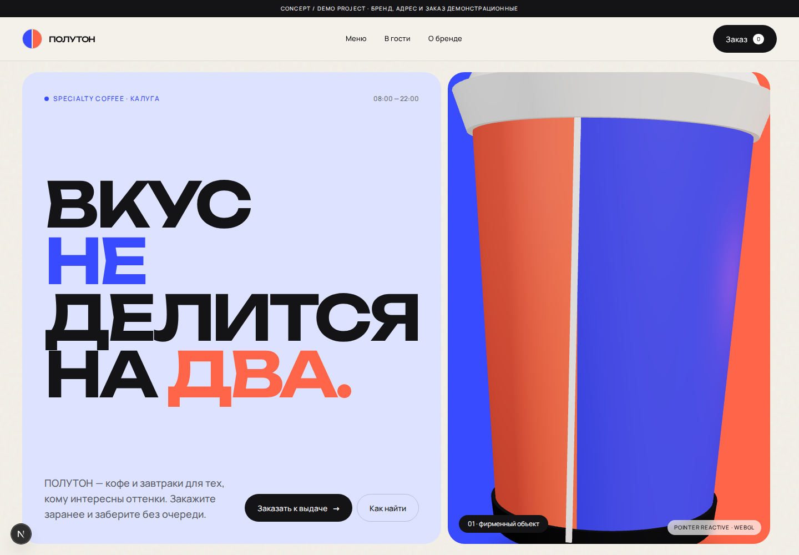

# ПОЛУТОН



Premium specialty coffee website — **Concept / Demo Project**.

ПОЛУТОН — вымышленный бренд. Проект создан как portfolio proof для brand design, art direction, meaningful 3D/motion, responsive frontend и commercial UX. Это не сайт реальной кофейни: адрес, цены, контакты и подтверждение заказа демонстрационные; настоящая оплата и бронирование не выполняются.

## Что реализовано

- editorial home с процедурным 3D-стаканом на React Three Fiber;
- полноценное меню с категориями, составами, тегами и состоянием корзины;
- demo preorder: состав заказа, время выдачи, validation, error и confirmation;
- visit UX: часы, текущий статус, ориентир и внешний map CTA;
- desktop realtime WebGL enhancement и 44 KB fallback для mobile, reduced motion, слабых устройств и ошибок WebGL;
- semantic HTML, keyboard/focus states, SEO, Open Graph, sitemap и robots;
- автоматические unit, responsive, flow и axe accessibility tests.

## Стек

Next.js 16 · React 19 · TypeScript · Tailwind CSS 4 · Motion · React Three Fiber / Drei · Playwright · Vitest

## Запуск

```bash
npm ci
npm run setup:browsers
npm run dev
```

Production и проверки:

```bash
npm run qa:full
```

Для Playwright можно передать локальный Chromium через `PLAYWRIGHT_CHROMIUM_EXECUTABLE_PATH`.
`qa:full` использует production build и пишет текущий performance-отчёт во временную директорию, поэтому не изменяет tracked portfolio artifacts. Осознанно обновить сохранённый snapshot можно командой `npm run test:performance:update`.

Проверки lint, types, unit, production build, responsive/E2E, axe accessibility и performance budgets также запускаются в GitHub Actions для pull request и каждого push в `main`.

## Материалы

- [исследование](./docs/reference-research.md);
- [product / brand direction](./docs/product-direction.md);
- [motion system](./docs/motion-system.md);
- [Figma handoff и подтверждённое ограничение коннектора](./design/figma-handoff.md);
- [portfolio case copy](./docs/portfolio-case.md);
- [QA report](./docs/qa-report.md);
- [design tokens](./design/tokens.tokens.json);
- [готовые screenshots](./artifacts/screenshots/).

Figma: https://www.figma.com/design/0MmlhT2IiB8oBj5UvvjBkJ
